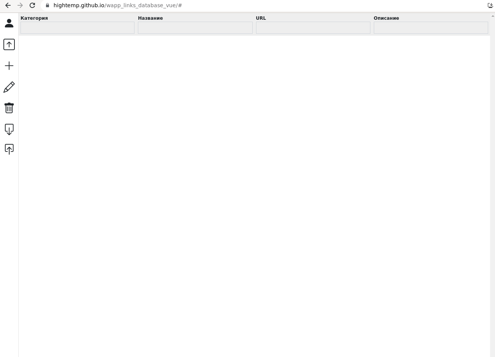

# wapp_links_database_vue

Простая база ссылокв (PWA) с возможностью сохранять в локальное хранилище, webdav, github.

[Демо](https://hightemp.github.io/wapp_links_database_vue/#)

- Добавлен `share_target` для PWA, т.е. можно отправлять ссылки в приложение.
- Добавлена возможность передачи репозитория по ссылке типа `?name=test&login=test2&repo=test&key=&type=github&url=&username=&password=`
    - старый перезаписывается
    - новый добавляется в конец
- Добавлена пагинация, которая адаптируется по высоту страницы
- Добалена возможность сохранять в несколько репозиториев

